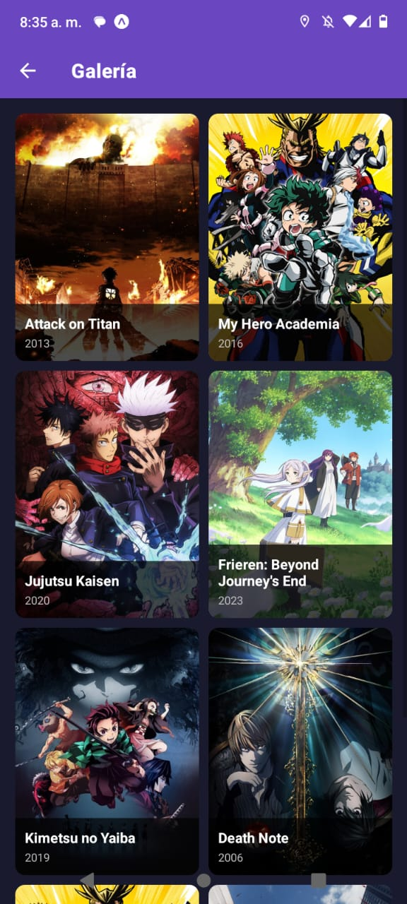
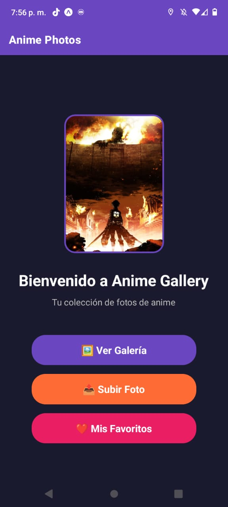
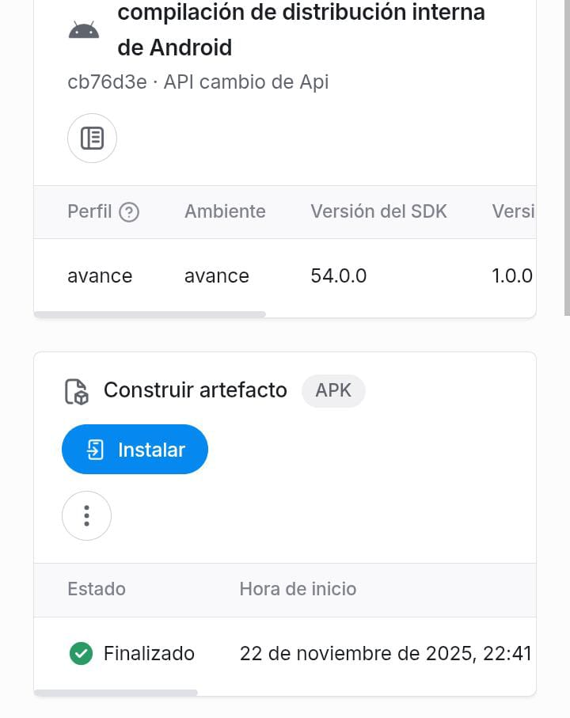
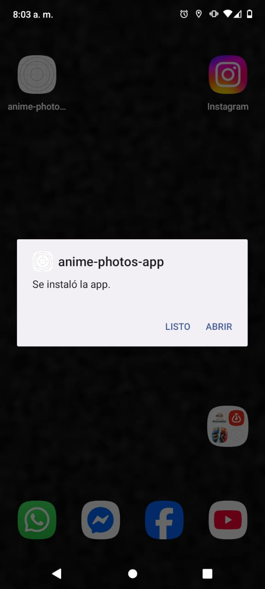
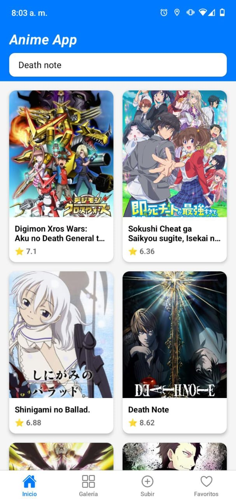

markdown# Anime Photos Gallery - App de Galería de Fotos de Anime

## 1. Identificación del Proyecto

- **Nombre de la App:** Anime Photos Gallery
- **Asignatura/Profesor:** Desarrollo de Aplicaciones Móviles / M.C. Leonel González Vidales
- **Periodo/Fecha:** Octubre 2025
- **URL del Repositorio:** https://github.com/isaiasguadalupe34/KodigoAnime

## 2. Descripción del Proyecto

Anime Photos Gallery es una aplicación móvil desarrollada con React Native y Expo que permite a los usuarios explorar una galería de anime, gestionar favoritos y subir sus propias fotos. La aplicación cuenta con una interfaz moderna con tema oscuro y navegación fluida entre pantallas.

### Características Principales:
- 📱 **Galería de Anime**: Lista de animes populares con información detallada
- 🎬 **Detalles Completos**: Vista detallada con descripción, género, año y estudio
- ❤️ **Sistema de Favoritos**: Guarda tus animes favoritos con contexto global
- 📤 **Subir Fotos**: Toma fotos o elige de tu galería para agregar nuevos animes
- 🎨 **Interfaz Moderna**: Diseño con tema oscuro y componentes estilizados
- 🧭 **Navegación Intuitiva**: Sistema de navegación stack con transiciones suaves

### Funcionalidades Implementadas:
- Galería con 8 animes precargados (Attack on Titan, My Hero Academia, etc.)
- Pantalla de detalles con información completa y botón de favoritos
- Sistema de favoritos persistente con React Context API
- Función de subir fotos desde galería o cámara
- Formulario completo para agregar información del anime
- Diseño responsivo y optimizado para móviles
- Estructura de código modular y escalable

## 3. Tecnologías y Versiones Utilizadas

### Stack Tecnológico:
- **React Native:** 0.81.4
- **React:** 19.1.0
- **Expo:** ~54.0.12
- **React Navigation:** v7.1.17 (Native Stack v7.3.26)
- **React Native Screens:** ~4.16.0
- **React Native Safe Area Context:** ~5.6.0
- **Expo Image Picker:** Compatible con Expo 54

### Herramientas de Desarrollo Requeridas:

- **Node.js:** v18.17.0 o superior
```bash
  node --version

  NPM: 9.0.0+ o Yarn v1.22.19+

  bash  npm --version

  Expo CLI: v6.3.0+

  bash  npx expo --version

  Android Studio: v2022.3+ con Android SDK 33+ o Expo Go app en dispositivo físico

  bash  # Verificar Android SDK
  adb --version
  Verificación de Entorno:
  bashnpx expo doctor

## 4. Estructura del Proyecto

### Organización de Archivos:
```
anime-photos-app/

├── App.js                          
├── app.json                        
├── package.json                   
├── babel.config.js                 
├── tsconfig.json                  
└── src/
    ├── context/                    
    │   └── FavoritesContext.js    
    ├── navigation/                 
    │   ├── AppNavigator.js        
    │   └── index.js             
    └── screens/                   
        ├── HomeScreen.js          
        ├── GalleryScreen.js       
        ├── DetailScreen.js       
        ├── FavoritesScreen.js     
        ├── UploadScreen.js        
        └── index.js              
```

### Arquitectura de la Aplicación:
- **App.js**: Componente raíz con NavigationContainer
- **AppNavigation.js**: Configuración del Stack Navigator
- **FavoritesContext.js**: Estado global para favoritos y fotos subidas
- **HomeScreen.js**: Pantalla principal con botones de navegación
- **GalleryScreen.js**: Grid de animes con fotos predeterminadas y subidas
- **DetailScreen.js**: Vista detallada con botón de favoritos
- **FavoritesScreen.js**: Lista de animes marcados como favoritos
- **UploadScreen.js**: Formulario para subir fotos con ImagePicker

## 5. Instalación y Configuración

### Instalación de Dependencias:
```bash
# Clonar el repositorio
git clone [tu-repositorio]
cd anime-photos-app

# Instalar dependencias
npm install
```

### Dependencias del Proyecto:

| Dependencia | Versión | Propósito |
|-------------|---------|-----------|
| `@react-navigation/native` | ^7.1.17 | Core de navegación entre pantallas, manejo de estado de navegación |
| `@react-navigation/native-stack` | ^7.3.26 | Stack navigator para navegación jerárquica (Lista → Detalles) |
| `react-native-screens` | ~4.16.0 | Optimización de rendimiento para transiciones nativas |
| `react-native-safe-area-context` | ~5.6.0 | Manejo de áreas seguras (notch, barras de estado) |
| `expo-status-bar` | ~3.0.8 | Control de apariencia de barra de estado |
| `expo` | ~54.0.3 | Framework de desarrollo móvil |
| `react` | 19.1.0 | Biblioteca de interfaz de usuario |
| `react-native` | 0.81.4 | Framework de desarrollo móvil multiplataforma |

# Clonar el repositorio
git clone https://github.com/isaiasguadalupe34/KodigoAnime
cd anime-photos-app

# Instalar dependencias
npm install
### Verificar instalación:
```bash
npm list --depth=0
```

## 6. Ejecución de la Aplicación

### Scripts Disponibles:
```bash
# Iniciar servidor de desarrollo
npm start
# o
npx expo start

# Ejecutar en Android (emulador/dispositivo)
npm run android
# o
npx expo start --android

# Ejecutar en iOS (solo macOS)
npm run ios
# o  
npx expo start --ios

# Ejecutar en web
npm run web
# o
npx expo start --web
```

### Primera Ejecución:
1. **Instalar dependencias:**
   ```bash
   npm install
   ```

2. **Instalar Image Picker:**

    ```bash   
    npx expo install expo-image-picker
    ```

3. **Conectar dispositivo:**
   - **Android:** Usar Expo Go o emulador
   - **iOS:** Usar Expo Go o simulador
   - **Web:** Se abrirá automáticamente en el navegador

### Notas de Entorno:
- **Emulador Android:** Debe estar iniciado antes de ejecutar `npm run android`
- **Dispositivo físico:** Usar Expo Go y escanear QR code
- **Túnel para redes restrictivas:** `npx expo start --tunnel`

## 7. Funcionalidades de la Aplicación

### Pantalla Principal (GalleryScreen):
- **Bienvenida**: Muestra una colección de películas en formato de tarjetas
- **Navegación Rápida**: Tres botones principales: Ver Galería,Subir Foto yMis Favoritos
- **Diseño**: Tema oscuro con botones coloridos y responsivos



### Pantalla de Detalles (DetailScreen):
- **Imagen Principal**: Portada oficial del anime
- **Información Completa**: 
Título del anime
Descripción detallada
Serie completa
Género
Año de estreno
Número de episodios
Estudio de animación
- **Boton de favoritos**: 
  -  "Alterna entre agregar/eliminar con alerta de confirmación"
- **Navegación**: Botón para regresar a la galería



### Datos de Ejemplo Incluidos:
- Shingeki no kyojin The Way of Water (2022)
- DEAT NOTE: (2022)
- ONE PUCH MAN (2022)
- NARUTO (2022)

### Características Técnicas:
- **Navegación Stack**: Transiciones suaves entre pantallas
- **Diseño Responsivo**: Optimizado para diferentes tamaños de pantalla
- **Tema Oscuro**: Interfaz moderna con colores oscuros
- **Componentes Modulares**: Código organizado y reutilizable

## 8. Desarrollo y Extensión

### Próximas Funcionalidades Sugeridas:
- **Integración con API**: Conectar con TMDB o similar para datos reales
- **Sistema de Favoritos**: Persistencia local con AsyncStorage
- **Categorías**: Organización por géneros
- **Notificaciones**: Alertas de nuevas fotos

### Estructura para Nuevas Pantallas:
```javascript
// Ejemplo de nueva pantalla
export function NewScreen() {
  const navigation = useNavigation();
  
  return (
    <View style={styles.container}>
      {/* Contenido de la pantalla */}
    </View>
  );
}
```

### Agregar Nuevas Rutas:
1. Actualizar `src/utils/screens.js` con nuevas constantes
2. Agregar Screen en `src/navigations/AppNavigation.js`
3. Crear componente en `src/screens/`

## 9. Troubleshooting

### Problemas Comunes:
| Problema | Solución |
|----------|----------|
| **Error de instalación** | `npm install --legacy-peer-deps` |
| **Metro cache corrupto** | `npx expo start --clear` |
| **Puerto ocupado** | `npx expo start --port 8082` |
| **Dependencias desactualizadas** | `npx expo doctor` |

### Comandos Útiles:
```bash
# Verificar entorno
npx expo doctor

# Limpiar cache
npx expo start --clear

# Reinstalar dependencias
rm -rf node_modules package-lock.json && npm install
```

## 10. Recursos y Documentación

- [Documentación de Expo](https://docs.expo.dev/)
- [React Navigation](https://reactnavigation.org/)
- [React Native Docs](https://reactnative.dev/)
- [Expo Components](https://docs.expo.dev/versions/latest/)

## 11. Crear el APK

### 1. Instalar EAS
npm install -g eas-cli

### 2. Login en Expo
eas login

### 3. Configurar proyecto
eas build:configure

### 4. Construir APK
eas build --platform android --profile preview

## 12. INSTALACION DE APK 
Este es el link: https://expo.dev/accounts/isaiasjg/projects/anime-photos-app/builds/6fca5fd2-0808-47fa-84a8-d72a47b14038

### Pantalla de instalacion:
- **Imagen Principal**: Portada oficial del anime  
- **Información Completa**: Se logra apreciar un botón de instalación.




## Pantalla Instalada:



---

**Desarrollado por:** Isaias Jimenez Guadalupe  
**Última actualización:** 26 de noviembre 2025  